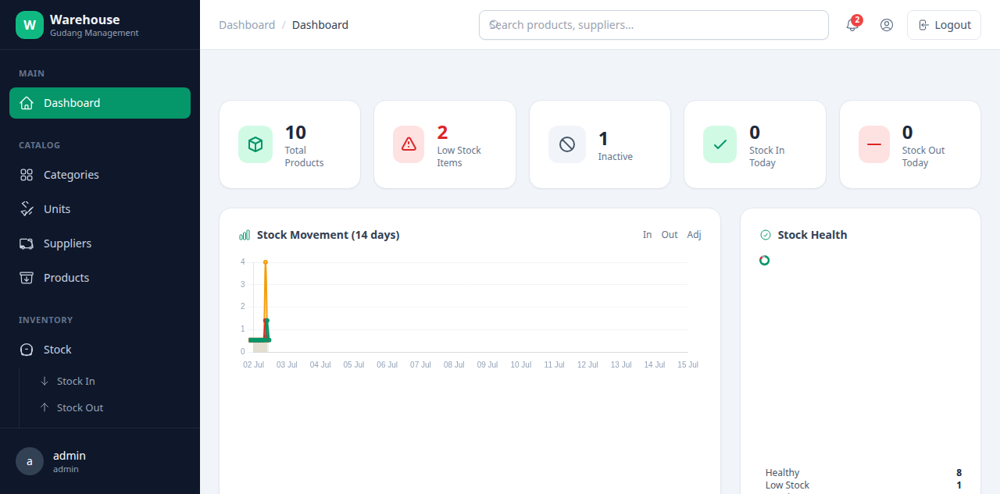

# Warehouse Inventory Management System


A modern, professional warehouse inventory management system built with Django 5 — designed for small-to-medium businesses.

## Technology Stack

| Layer | Technology |
|---|---|
| Backend | Django 5.2 + Django ORM |
| Database | SQLite (dev, default) / PostgreSQL (production — switch via `DB_ENGINE=postgres`) |
| Auth | Django Authentication + Custom User Model (role-based) |
| Admin | Django Admin (configured for usability) |
| Frontend | Django Templates + Tailwind CSS (npm build) + HTMX + Alpine.js |

## Features

### ✅ Done

- [x] **Project Foundation** — multi-app structure, settings with SQLite/PostgreSQL toggle, .gitignore, requirements
- [x] **Authentication** — Login/Logout (POST+CSRF), Change Password, User Profile
- [x] **User Roles** — Administrator, Warehouse Staff (via custom `User.role` field)
- [x] **Django Admin** — beautiful admin with filters, search, ordering, custom fieldsets
- [x] **UI Shell** — sidebar + topbar layout, Tailwind build via npm, HTMX + Alpine.js locally served, responsive, ERP-style
- [x] **Categories** — full CRUD (List + pagination, Detail, Create, Update, Delete)
- [x] **Units** — full CRUD (name + abbreviation; seeded: pcs, box, kg, liter, pack, m, roll, set)
- [x] **Suppliers** — full CRUD (company name, contact person, phone, email, address)
- [x] **Products** — CRUD with SKU, barcode, image, category FK, unit FK, supplier FK, price, stock, search/filter/pagination, N+1 prevention (select_related)
- [x] **Stock In** — multi-line form with batch number & expiry date tracking, auto-increase stock via signal, atomic transactions
- [x] **Stock Out** — multi-line form, auto-decrease stock, FEFO (First Expired First Out) batch auto-selection, negative stock prevention (rollback)
- [x] **Stock Adjustment** — reason (lost/damaged/expired/correction) + direction (add/remove), atomic, negative stock protection
- [x] **Batch & Expiry Tracking (FEFO)** — `ProductBatch` model tracks inventory per batch/lot number with expiry dates; Stock In creates batches, Stock Out automatically picks earliest-expiring batch with available stock
- [x] **Dashboard** — 5 stat cards (total, low stock, inactive, in/out today), low-stock table, recent activity, **date-range filter** (7/30/90/365 days), **expiring batches alert**, **top 5 fast-moving items**
- [x] **Dashboard Charts** — line chart (In/Out/Adjustment per day) + doughnut (Healthy/Low Stock/Inactive distribution) + Supplier Value Share doughnut (Chart.js, vendored)
- [x] **Transaction History** — filter by type, date range, product search (name/SKU), pagination
- [x] **Reports** — Inventory Report (summary cards + valuation), Low Stock Report (shortage + supplier), Stock Card (per-product movement), CSV export all 3
- [x] **Notifications** — computed low-stock alerts (critical/warning), severity cards with inline Stock In action
- [x] **Global Search** — unified search across products (name/SKU/barcode), suppliers (company/contact), transactions (reference)
- [x] **Settings** — company profile, warehouse info, preferences (low-stock threshold, currency), single-row model singleton pattern
- [x] **Multi-Language Support (i18n)** — dynamic switching between English & Bahasa Indonesia on any page, saved in user sessions/cookies
- [x] **Auto-SKU & Barcode Generation** — automatic sequential SKU generation based on category prefix (e.g. `ELE-0004`) and unique UPC barcode if left empty
- [x] **Print-Friendly Pages** — print-optimized layout stylesheet (`@media print`) and inline print buttons for all reports and transactions
- [x] **Audit Trail (Activity Logs)** — paginated system audit logs showing user, timestamp, actions, and details
- [x] **Active Status Guards** — safety filters and validations restricting choices/transactions on inactive products, categories, units, and suppliers
- [x] **Reorder Recommendations** — automated shortage calculation and pre-formatted email draft templates grouped by supplier with one-click copy
- [x] **Visual Barcode & Sticker Sheet Printing** — dynamic SVG barcode generation (CODE128) on detail page and print-friendly sticker sheets
- [x] **Webcam Barcode Scanner** — real-time webcam scanning via WebRTC (`html5-qrcode`) for quick product selection during transactions
- [x] **Styled Excel Exports (.xlsx)** — polished spreadsheet generator (`openpyxl`) with emerald headers, auto-fit widths, and proper currency formats
- [x] **Supplier Share Analytics** — visual dashboard doughnut chart depicting inventory value share per supplier
- [x] **Dashboard Date-Range Filter** — dynamic toggle buttons (7 / 30 / 90 / 365 days) to filter all dashboard charts and analytics
- [x] **Expiring Batch Alerts** — dashboard table showing batches expiring within 30 days with color-coded urgency badges (expired / critical / warning)
- [x] **Fast-Moving Items Analysis** — dashboard ranking of top 5 most-dispatched products within selected date range

## Screenshot



*Dashboard with stat cards, date-range filter, charts, expiring batch alerts, and fast-moving items analysis.*

## Quick Start

```bash
# Clone & enter
git clone https://github.com/afdhalpower/djangogudang.git
cd djangogudang

# Setup Python environment
/usr/bin/python3.12 -m venv .venv
source .venv/bin/activate
pip install -r requirements.txt

# Setup Tailwind CSS
cd tailwind
npm install
npm run build
cd ..

# Database & superuser
python manage.py migrate
python manage.py createsuperuser

# Start dev server
python manage.py runserver
```

Open http://127.0.0.1:8000/ and log in.

### Switch to PostgreSQL

Copy `.env.example` to `.env`, set `DB_ENGINE=postgres` and fill the PostgreSQL credentials. That's it — Django picks it up automatically.

## Project Structure

```
djangogudang/
├── config/           # Project package (settings, urls, wsgi, asgi)
├── accounts/         # Custom User model, auth views, profile
├── dashboard/        # Home page with charts, expiry alerts, analytics
├── categories/       # Product categories CRUD
├── units/            # Measurement units CRUD
├── suppliers/        # Supplier management CRUD
├── products/         # Product management with SKU/barcode
├── stock/            # Stock transactions, batch tracking (FEFO)
├── reports/          # Inventory, low-stock, stock-card reports
├── notifications/    # Low-stock alert system
├── core/             # Shared utilities, activity logging
├── settings_app/     # Company/warehouse settings
├── templates/        # Global + per-app templates
├── tailwind/         # Tailwind CSS source (npm)
├── static/           # Built CSS + vendor JS (HTMX, Alpine, Chart.js)
└── manage.py         # Django CLI
```

## License

Released under the [MIT License](LICENSE).
© 2026 afdhalpower.
